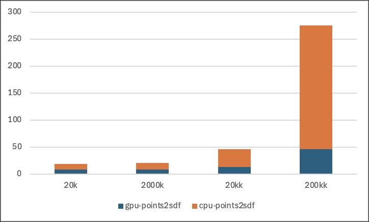

# point2sdf
a cuda-based method to sample points' sdf from original mesh


## performence



## install 

- install torch 
- install pytorch3d
- install cuda_kdtree

```shell
# pull cukdtree repo 

cd cukdtree && pip install .

```

## usage

sample

```
python apps/example.py --input /path/to/mesh.obj --output /path/to/sample.npy [--cuda]
```

vis gt

```
python apps/reconstruction.py --input /path/to/sample.npy --output /path/to/recon.obj [--type occ]
```

## change-log

- [x] gpu and cpu sampling with kdtree and mesh normal.
